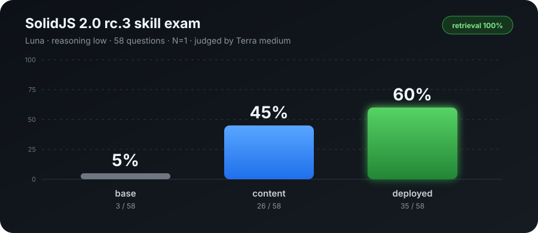

# solidjs-v2-skills

SolidJS 2.0 skills for coding agents, checked against published packages and
upstream source.

Solid 2.0 changed enough of the framework that code based on Solid 1.x or
React habits can look plausible and still be wrong. This repository gives
agents a verified v2 reference for writing new code, migrating 1.x projects,
and reviewing diffs.

> Current target: `solid-js@2.0.0-rc.5`, `@solidjs/web@2.0.0-rc.5`,
> `@solidjs/signals@2.0.0-rc.5`, and `@solidjs/diagnostics@2.0.0-rc.5`.

## Measured effect



On the full 58-question rc.3 exam, Luna at low reasoning went from **5%**
without the skill to **60%** with the deployed skill. It retrieved the right
skill content in all 58 deployed cases.

These are historical rc.3 results. The current rc.5 bank contains 70 questions,
so the command below documents the original run rather than reproducing it from
current `HEAD`.

This is a single run, not a confidence interval. Terra at medium reasoning
graded each answer against a fixed, source-backed rubric.

<details>
<summary>Axis breakdown and exact command</summary>

| axis | base | content | deployed |
|---|---:|---:|---:|
| API | 3% | 47% | 60% |
| patterns | 6% | 50% | 67% |
| Solid vs React | 20% | 20% | 40% |
| Solid 1.x vs 2.0 | 0% | 40% | 60% |

`content` injects the skill and the one routed reference. `deployed` starts an
isolated Codex agent and makes it retrieve those files itself.

```sh
node evals/run.mjs --provider codex --models gpt-5.6-luna --reasoning low \
  --conditions base,content,deployed --grader-provider codex \
  --grader gpt-5.6-terra --grader-reasoning medium --concurrency 4
```

</details>

## What's included

| skill | use it for |
|---|---|
| `solidjs-v2` | Writing and editing Solid 2.0 code. Covers reactivity, async data and actions, stores, control flow, DOM, server functions, experimental server components, and TypeScript. |
| `solidjs-v2-migration` | Moving a Solid 1.x codebase or file to 2.0. Includes a four-pass workflow and a rename/removal map with recipes. |
| `solidjs-v2-reviewer` | Reviewing Solid 2.0 diffs for React habits, 1.x APIs, and reactivity bugs. Includes greppable smell tables and concrete fixes. |

The three skills share the same reference files across Codex, Claude Code, and
`npx skills`; there are no host-specific copies to drift apart. Each skill
checks the installed Solid major first and refuses to apply v2 rules to a 1.x
project.

## Install

Choose one installation method. Installing the same skills through several
hosts will load duplicate copies.

### `npx skills` (recommended)

[`vercel-labs/skills`](https://github.com/vercel-labs/skills) works with Claude
Code and many other agents.

```sh
npx skills add khmm12/solidjs-v2-skills
```

Add `-g` for a global install, or install one skill only:

```sh
npx skills add khmm12/solidjs-v2-skills -g
npx skills add khmm12/solidjs-v2-skills@solidjs-v2
```

From a local clone, use `npx skills add ./solidjs-v2-skills`. Update later with
`npx skills update`.

<details>
<summary>Install as a Codex plugin</summary>

```sh
codex plugin marketplace add khmm12/solidjs-v2-skills
codex plugin add solidjs-v2-skills@solidjs-v2-skills
```

For a local clone:

```sh
codex plugin marketplace add /absolute/path/to/solidjs-v2-skills
codex plugin add solidjs-v2-skills@solidjs-v2-skills
```

Start a new Codex session after installation. Refresh the Git-backed
marketplace with:

```sh
codex plugin marketplace upgrade solidjs-v2-skills
```

</details>

<details>
<summary>Install as a Claude Code plugin</summary>

```text
/plugin marketplace add khmm12/solidjs-v2-skills
/plugin install solidjs-v2-skills@solidjs-v2-skills
```

For a local clone, replace the repository name in the first command with its
absolute path. Plugin skills are namespaced as
`solidjs-v2-skills:solidjs-v2`; auto-triggering is unchanged.

</details>

<details>
<summary>Install as personal symlinks</summary>

```sh
git clone https://github.com/khmm12/solidjs-v2-skills.git
cd solidjs-v2-skills
for skill in solidjs-v2 solidjs-v2-migration solidjs-v2-reviewer; do
  ln -sfn "$(pwd)/skills/$skill" ~/.claude/skills/$skill
done
```

This is unnamespaced and updates immediately with `git pull`.

</details>

## Version and sources

The references are distilled from Solid's `documentation/solid-2.0/`
(MIGRATION.md and RFC 01–12) and the official `packages/solid/CHEATSHEET.md` at
`solidjs/solid@5eb3250a` (the published rc.5 tag commit). API claims are checked
against the published rc.5 typings and runtime first, then the matching
upstream sources and tests.

Solid 2.0 is still a prerelease. Before teaching a new API, the maintenance
workflow also checks pending upstream changesets. See [AGENTS.md](AGENTS.md)
for the full update procedure.

## Run the exam

The dependency-free runner supports Claude and Codex answer models, separate
answer and grader models, and three conditions: no skill, injected content,
and deployed retrieval.

```sh
node evals/run.mjs --quick
node evals/run.mjs --provider codex --models gpt-5.6-luna --quick
```

Codex runs use an ephemeral, auth-only `CODEX_HOME`, a read-only sandbox, and a
neutral working directory. Tool use invalidates control cells instead of
quietly contaminating the score. Results are written under the git-ignored
`evals/results/` directory.

See [evals/PLAN.md](evals/PLAN.md) for the rubric, condition semantics, and
release-grade commands.
